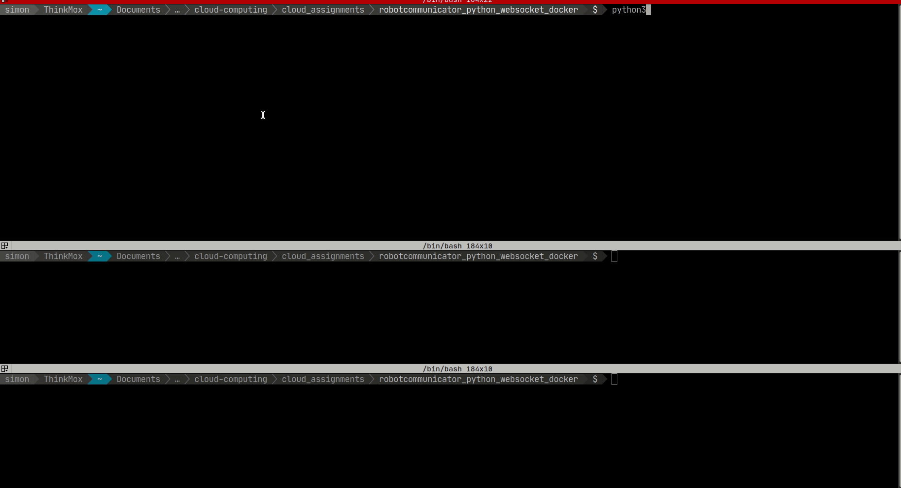

# robot_communicator_python_websocket

## Launch Robotcommunicator WebSocket
Installeer alle benodigdheden in `requirements.txt` met: `pip3 install --no-cache-dir -r requirements.txt
`  
  
Start één instantie van de "server" of communicator met `python3 communicator.py`  
  
Nu kan je in meerdere terminals een instantie van de robot maken met `python3 robot.py`. Vul de gevraagde gevens in voor de robot en stuur het naar een 3D-locatie naar keuze!

## Demo  
*De bovenste terminal is de server of communicator, de andere zijn verschillende instanties van de robot.*
  

## Reden voor keuze van service
Ik ben een schakelstudent afkomstig uit de professionele bachelor applicatieontwikkeling met keuzetraject AI & Robotics. Hier hebben we met het softwarepakket genaamd ROS (Robot Operating System) gewerkt. Onder de motorkap gebruikt ROS ook websockets. Deze service leek me een perfecte opportuniteit om eens een eigen implementatie van WebSockets in Python te maken.

## Technologies
* Python
* WebSockets
* Async (in Python)